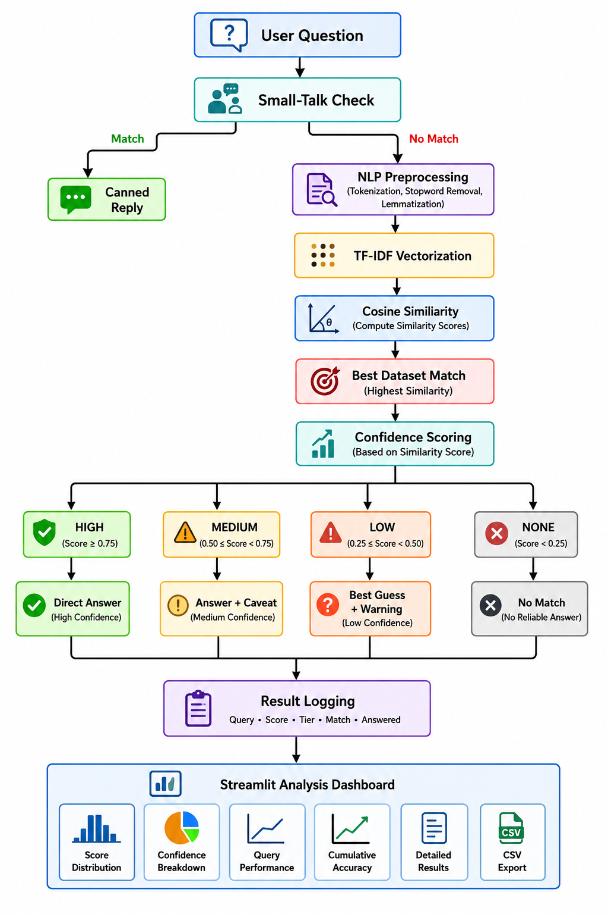

# Academic NLP Chatbot

An academic question-answering chatbot built using **Natural Language Processing (NLP)** and **Machine Learning** techniques. The system matches user questions against a predefined knowledge base using **TF-IDF vectorization** and **Cosine Similarity**, then returns the answer associated with the most relevant question.

The project also includes a **Streamlit-based interactive dashboard** for visualizing similarity scores, confidence levels, query accuracy, and matching results.

## Features

* **NLP-based question matching**

  * Converts questions into normalized tokens.
  * Removes English stopwords and punctuation.
  * Applies WordNet lemmatization.

* **TF-IDF Vectorization**

  * Converts the processed dataset questions into numerical feature vectors.
  * The vectors are generated once when the chatbot starts.

* **Cosine Similarity Matching**

  * Compares the user's question against every question in the dataset.
  * Selects the question with the highest similarity score.

* **Confidence Classification**

  * Classifies matches into four confidence levels:

    * **High:** ≥ 0.55
    * **Medium:** ≥ 0.30
    * **Low:** ≥ 0.10
    * **None:** < 0.10

* **Top-3 Matching Questions**

  * Displays the three highest-scoring dataset questions for each query.

* **Conversational Responses**

  * Supports basic greetings, thanks, and goodbye messages without running them through the NLP matching pipeline.

* **Result Analysis Dashboard**

  * Total queries
  * Answered queries
  * Average similarity score
  * Confidence distribution
  * Per-query similarity scores
  * Cumulative accuracy
  * Confidence vs. answered summary

* **CSV Export**

  * Query results can be downloaded for further analysis.

## System Architecture



## NLP Pipeline

The chatbot applies the following preprocessing steps to both the dataset questions and incoming user queries.

### 1. Lowercasing

All text is converted to lowercase so that words such as:

```text
Machine Learning
machine learning
MACHINE LEARNING
```

are treated consistently.

### 2. Tokenization

The input sentence is divided into individual tokens using NLTK's tokenizer.

For example:

```text
"What is machine learning?"
```

becomes approximately:

```text
["what", "is", "machine", "learning", "?"]
```

### 3. Stopword Removal

Common English words that provide relatively little information for matching are removed.

Examples include:

```text
is
the
a
an
of
and
```

### 4. Punctuation Removal

Punctuation tokens are removed before vectorization.

### 5. Lemmatization

Words are reduced to their dictionary base form using `WordNetLemmatizer`.

For example:

```text
learning → learning
cars     → car
studies  → study
```

The resulting processed text is then passed to the TF-IDF vectorizer.

---

## TF-IDF

The project uses `TfidfVectorizer` from Scikit-learn.

TF-IDF represents each question as a numerical vector based on the importance of its words within the dataset.

The basic formulation is:

```text
TF-IDF = Term Frequency × Inverse Document Frequency
```

Words that occur frequently across the entire dataset receive less importance, while words that are more distinctive to particular questions receive greater weight.

The TF-IDF matrix for all dataset questions is created once during startup:

```python
X = vectorizer.fit_transform(processed_questions)
```

When a user asks a question, the same vectorizer transforms the query into the same feature space:

```python
user_vec = vectorizer.transform([processed])
```

This allows the query to be compared directly with the dataset questions.

## Cosine Similarity

The chatbot uses cosine similarity to measure how similar the user's question is to each question in the knowledge base.

Conceptually:

```text
                    A · B
Cosine Similarity = ───────
                    |A||B|
```

The score generally ranges from:

```text
0 → completely different
1 → identical direction
```

The chatbot selects the dataset question with the highest score:

```python
score = float(similarity.max())
index = int(similarity.argmax())
```

The corresponding answer is then retrieved from the dataset.

---

## Confidence System

The similarity score is converted into a confidence tier.

|       Score | Confidence | Behaviour                                    |
| ----------: | ---------- | -------------------------------------------- |
|      ≥ 0.55 | High       | Answer returned directly                     |
| 0.30–0.5499 | Medium     | Answer returned with a partial-match warning |
| 0.10–0.2999 | Low        | Best guess shown with a warning              |
|      < 0.10 | None       | No answer returned                           |

These thresholds are **heuristic thresholds**, not probabilities. A score of `0.80`, for example, does **not** mean the chatbot is 80% certain that its answer is correct.

## Dataset

The chatbot expects a CSV knowledge base named:

```text
dataset.csv
```

The CSV must contain at least two columns:

```text
Question,Answer
```

Example:

```csv
Question,Answer
"What is NLP?","Natural Language Processing is a field of AI..."
"What is TF-IDF?","TF-IDF is a statistical method..."
"What is machine learning?","Machine learning is a branch of AI..."
```

The questions are used as the searchable knowledge base, while the corresponding answers are returned when a sufficiently similar question is found.

## Streamlit Interface

The application contains two main sections.

### 💬 Chat

The Chat tab provides the main chatbot interface.

It displays:

* User questions
* Chatbot responses
* Confidence warnings
* Best matching dataset question
* Top-3 matching questions and their similarity scores

### 📊 Result Analysis

The Result Analysis tab provides analytical information about the queries submitted during the current Streamlit session.

#### Key Performance Indicators

The dashboard displays:

* **Total Queries**
* **Answered Queries**
* **Average Match Score**
* **Accuracy**
* **High Confidence Queries**

#### Score Distribution

Shows the distribution of cosine similarity scores across submitted queries and marks the confidence threshold zones.

#### Confidence Tier Breakdown

Displays how many queries were classified as:

```text
High
Medium
Low
None
```

#### Match Score per Query

Displays the similarity score for every query and visually identifies its confidence tier.

#### Cumulative Accuracy

The dashboard calculates running accuracy as:

```text
High + Medium queries
────────────────────── × 100
    Total queries
```

Medium-confidence matches are therefore counted as successful for this project-level metric.

#### Detailed Results

Each processed query is recorded with:

```text
Query
Matched Question
Score
Confidence
Answered
```

Results can also be exported as:

```text
nlp_results.csv
```

## Project Structure

```text
academic-nlp-chatbot/
│
├── chatbot.py
├── app.py
├── dataset.csv
├── requirements.txt
└── README.md
```

### `chatbot.py`

Contains the NLP and chatbot logic:

* Dataset loading
* Text preprocessing
* TF-IDF vectorization
* Cosine similarity
* Confidence classification
* Small-talk handling
* Top-N matching
* Response generation

### `app.py`

Contains the Streamlit application:

* Chat interface
* Session state
* Result logging
* Analysis dashboard
* Charts
* CSV export

### `dataset.csv`

Contains the chatbot's question-answer knowledge base.

---

## Installation

### 1. Clone the repository

```bash
git clone <repository-url>
cd academic-nlp-chatbot
```

### 2. Create a virtual environment

```bash
python -m venv venv
```

Activate it on Windows:

```bash
venv\Scripts\activate
```

On macOS/Linux:

```bash
source venv/bin/activate
```

### 3. Install dependencies

```bash
pip install -r requirements.txt
```

A suitable `requirements.txt` is:

```text
pandas
nltk
scikit-learn
streamlit
matplotlib
numpy
```

### 4. Run the application

```bash
streamlit run app.py
```

The application will open in your browser.

---

## NLTK Resources

The application automatically downloads the required NLTK resources on its first launch:

```python
nltk.download('punkt', quiet=True)
nltk.download('punkt_tab', quiet=True)
nltk.download('stopwords', quiet=True)
nltk.download('wordnet', quiet=True)
```

Therefore, no separate manual NLTK corpus setup is required.

---

## Example

Suppose the dataset contains:

```text
Question:
What is TF-IDF?

Answer:
TF-IDF is a numerical representation that measures the importance of a word in a document relative to a collection of documents.
```

A user could ask:

```text
Can you explain TF IDF?
```

The chatbot preprocesses the query, converts it into a TF-IDF vector, compares it with the dataset questions, and calculates the cosine similarity.

If the resulting score is:

```text
0.78
```

the query is classified as:

```text
High Confidence
```

and the corresponding answer is returned.

---

## Limitations

This chatbot is intentionally based on **retrieval rather than generative NLP**.

It does not generate new answers using a language model. Instead, it retrieves the answer associated with the most similar question in the dataset.

Consequently:

* It cannot reliably answer questions outside the dataset's domain.
* Similar wording does not necessarily imply semantic equivalence.
* Synonyms and paraphrases may receive relatively low similarity scores.
* The quality of responses depends heavily on the dataset.
* Confidence thresholds are manually selected heuristics.
* Cosine similarity is not a true measure of answer correctness.
* The chatbot does not maintain conversational context between questions.
* Small-talk detection is based on exact string matching.

For example, these inputs may not behave identically:

```text
hello
Hello!
hey there
good morning
```

because the current small-talk implementation checks exact trigger strings rather than using semantic matching.

---

## Technologies Used

| Technology   | Purpose                                          |
| ------------ | ------------------------------------------------ |
| Python       | Core programming language                        |
| NLTK         | Tokenization, stopword removal and lemmatization |
| Pandas       | Dataset loading and result analysis              |
| Scikit-learn | TF-IDF and cosine similarity                     |
| NumPy        | Numerical operations                             |
| Matplotlib   | Data visualization                               |
| Streamlit    | Web interface and dashboard                      |

---

## Future Improvements

Possible improvements include:

* Replace TF-IDF with **semantic embeddings** such as Sentence-BERT.
* Add fuzzy/semantic small-talk detection.
* Support conversational context.
* Improve confidence calibration using a labelled evaluation dataset.
* Add a proper train/test evaluation pipeline.
* Introduce precision, recall and F1-score evaluation.
* Add an administrator interface for updating the knowledge base.
* Persist query logs instead of storing them only in Streamlit session state.
* Add multilingual NLP support.
* Use a hybrid retrieval system combining lexical and semantic similarity.

---

## Conclusion

This project demonstrates how a lightweight NLP-based question-answering system can be built without a large language model.

The chatbot combines **text preprocessing, TF-IDF feature extraction, cosine similarity, heuristic confidence classification, and interactive Streamlit visualization** to create an interpretable academic question-answering system.

The result analysis dashboard provides additional visibility into how confidently the system is matching user queries against its knowledge base.
